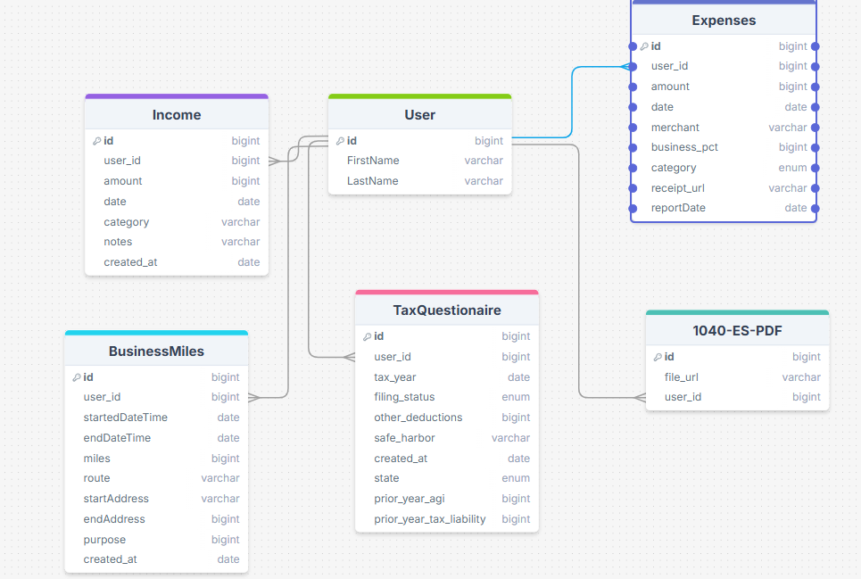

Hi welcome to the design of TaxTrail

The purpose of the app is to help people do their quarterly self employment taxes to help them avoid the underpayment penalty. 

Key features include: Receipt parsing and storage, PDF geneartion for form 1040-ES, and  miles tracker

Right now I am using Expo React Native and supabase. Probably will need to use Google's map api service for android.

    
        

